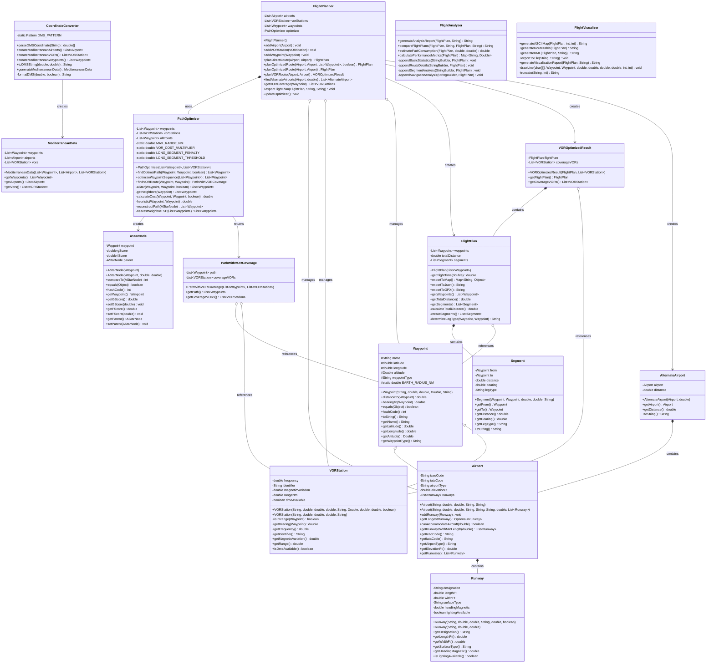
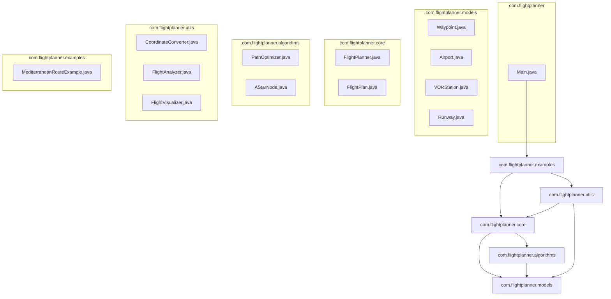
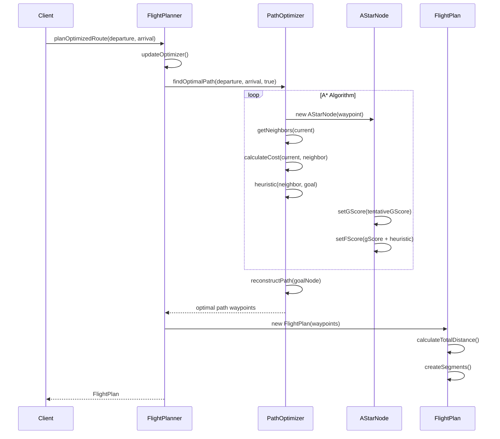
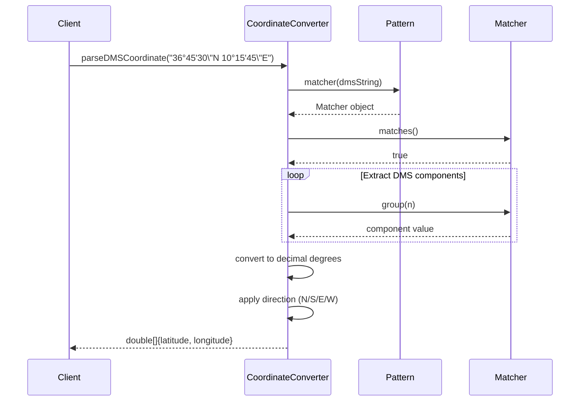
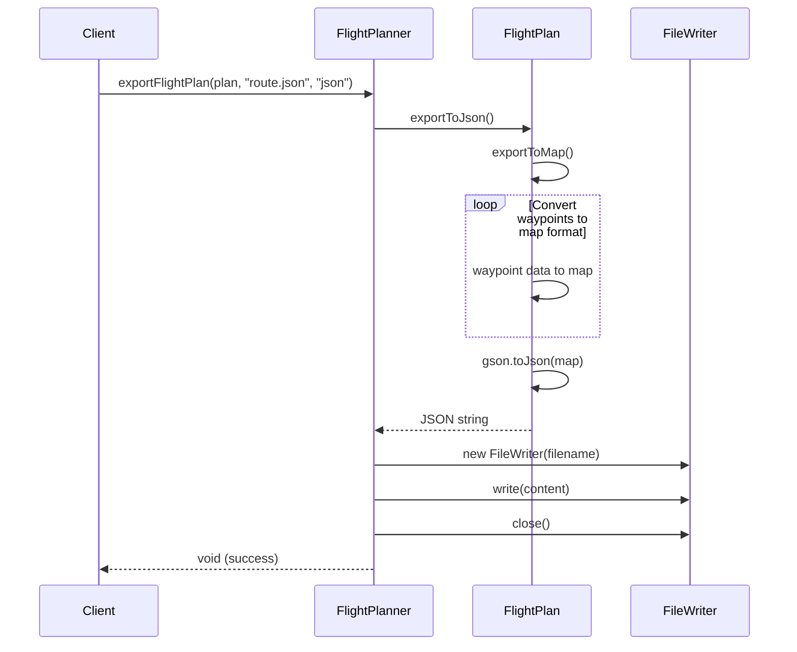
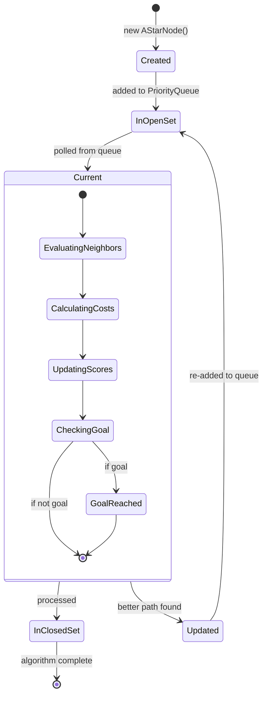
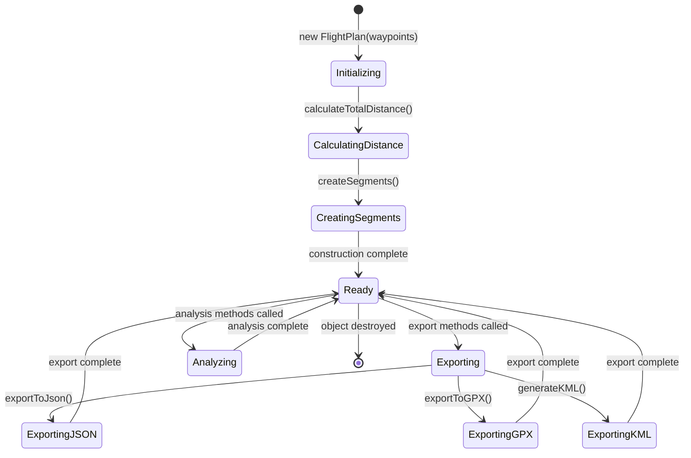
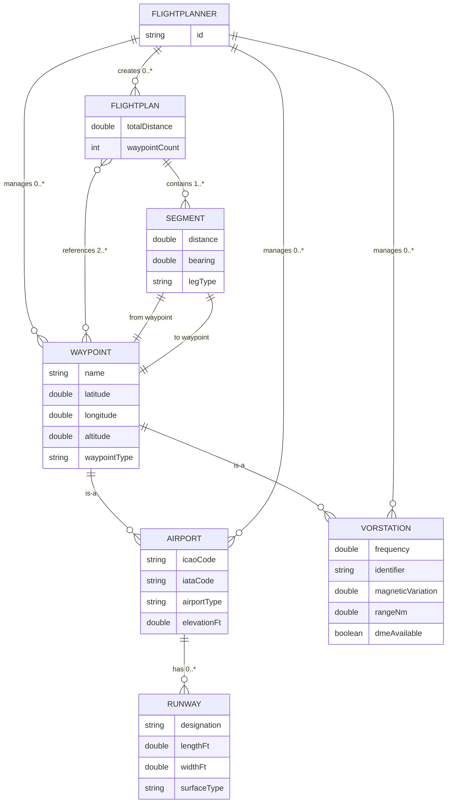

# Diagrammes de Classes - Flight Planner Java

## Table des Matières

1. [Diagramme de classes principal](#diagramme-de-classes-principal)
2. [Diagramme de packages](#diagramme-de-packages)
3. [Diagrammes de séquence](#diagrammes-de-séquence)
4. [Diagrammes d'états](#diagrammes-détats)
5. [Relations et cardinalités](#relations-et-cardinalités)

---

## Diagramme de classes principal

### Vue d'ensemble architecturale



---

## Diagramme de packages

### Structure des packages



### Responsabilités des packages

| Package | Responsabilité | Classes principales |
|---------|---------------|-------------------|
| `models` | Modèles de données aviation | Waypoint, Airport, VORStation, Runway |
| `core` | Logique métier principale | FlightPlanner, FlightPlan |
| `algorithms` | Algorithmes d'optimisation | PathOptimizer, AStarNode |
| `utils` | Utilitaires et helpers | CoordinateConverter, FlightAnalyzer, FlightVisualizer |
| `examples` | Exemples d'utilisation | MediterraneanRouteExample |

---

## Diagrammes de séquence

### 1. Séquence de planification de route optimisée



### 2. Séquence de conversion de coordonnées DMS



### 3. Séquence d'export de plan de vol



---

## Diagrammes d'états

### 1. États d'un AStarNode dans l'algorithme A*



### 2. États d'un FlightPlan



---

## Relations et cardinalités

### 1. Relations entre classes principales



### 2. Cardinalités détaillées

| Relation | Cardinalité | Description |
|----------|-------------|-------------|
| Airport → Runway | 1 → 0..* | Un aéroport peut avoir 0 à plusieurs pistes |
| FlightPlanner → Airport | 1 → 0..* | Un planificateur gère 0 à plusieurs aéroports |
| FlightPlanner → VORStation | 1 → 0..* | Un planificateur gère 0 à plusieurs VOR |
| FlightPlanner → Waypoint | 1 → 0..* | Un planificateur gère 0 à plusieurs waypoints |
| FlightPlan → Waypoint | 1 → 2..* | Un plan référence au moins 2 waypoints (départ/arrivée) |
| FlightPlan → Segment | 1 → 1..* | Un plan contient au moins 1 segment |
| Segment → Waypoint (from) | 1 → 1 | Chaque segment a exactement 1 waypoint de départ |
| Segment → Waypoint (to) | 1 → 1 | Chaque segment a exactement 1 waypoint d'arrivée |

### 3. Contraintes d'intégrité

#### Contraintes géographiques
```java
// Coordonnées valides
-90.0 ≤ latitude ≤ 90.0
-180.0 ≤ longitude ≤ 180.0
altitude ≥ -1000.0 (si spécifiée)
```

#### Contraintes aviation
```java
// Fréquences VOR valides
108.0 ≤ frequency ≤ 118.0 (MHz)
rangeNm > 0.0
0.0 ≤ magneticVariation ≤ 360.0

// Pistes d'aéroport
lengthFt > 0.0
widthFt > 0.0
0.0 ≤ headingMagnetic < 360.0
```

#### Contraintes de plan de vol
```java
// Au minimum départ et arrivée
waypoints.size() ≥ 2

// Distance de segment raisonnable
0.0 < segment.distance ≤ MAX_RANGE_NM (500.0)

// Continuité de route
segment[i].to.equals(segment[i+1].from)
```

Cette documentation des diagrammes de classes fournit une vue complète de l'architecture du système Flight Planner Java, facilitant la compréhension, la maintenance et l'évolution du code.
