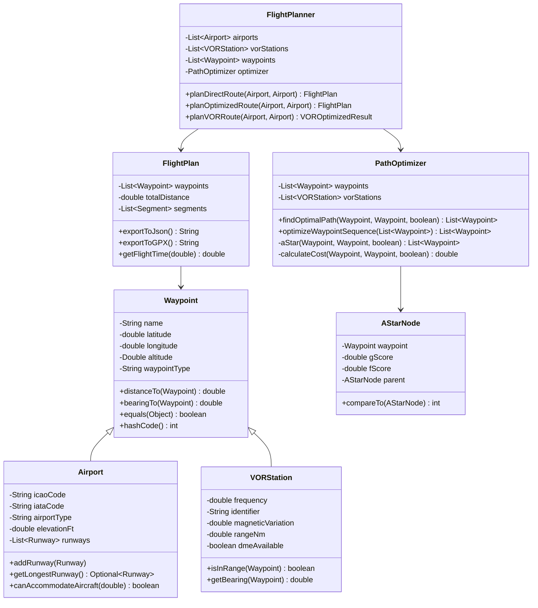

# Documentation Technique - Flight Planner Java

## Table des Matières

1. [Vue d'ensemble du système](#vue-densemble-du-système)
2. [Architecture et diagramme de classes](#architecture-et-diagramme-de-classes)
3. [Algorithme d'optimisation A*](#algorithme-doptimisation-a)
4. [Contraintes aviation prises en compte](#contraintes-aviation-prises-en-compte)
5. [Implémentation des modèles de données](#implémentation-des-modèles-de-données)
6. [Système de coordonnées et conversion DMS](#système-de-coordonnées-et-conversion-dms)
7. [Analyse des performances](#analyse-des-performances)
8. [Évolutions possibles](#évolutions-possibles)
9. [Guide d'utilisation avancée](#guide-dutilisation-avancée)

---

## Vue d'ensemble du système

### Objectif
Le Flight Planner Java est un système d'optimisation de routes aériennes qui utilise l'algorithme A* avec des heuristiques spécifiques à l'aviation pour calculer les trajets optimaux entre aéroports, en tenant compte des waypoints intermédiaires et des stations VOR.

### Cas d'usage principal
Planification de route méditerranéenne : Tunis Carthage (DTTA) → Santorini (LGSR) avec 14 waypoints intermédiaires et 2 stations VOR (TUC, MIL).

### Technologies utilisées
- **Java 11+** avec programmation orientée objet
- **Maven** pour la gestion des dépendances
- **JUnit 5** pour les tests unitaires
- **Gson** pour l'export JSON
- **Collections Framework** pour les structures de données optimisées

---

## Architecture et diagramme de classes

### Hiérarchie des classes principales

```
Waypoint (classe de base)
├── Airport (hérite de Waypoint)
│   └── List<Runway>
├── VORStation (hérite de Waypoint)
│   ├── frequency: double
│   ├── identifier: String
│   ├── magneticVariation: double
│   ├── rangeNm: double
│   └── dmeAvailable: boolean
└── (Waypoint standard pour points intermédiaires)

FlightPlanner (classe principale)
├── List<Airport> airports
├── List<VORStation> vorStations  
├── List<Waypoint> waypoints
└── PathOptimizer optimizer

PathOptimizer (algorithme A*)
├── List<Waypoint> allPoints
├── List<VORStation> vorStations
└── algorithmes d'optimisation

FlightPlan (résultat)
├── List<Waypoint> waypoints
├── double totalDistance
├── List<Segment> segments
└── méthodes d'export (JSON, GPX, KML)
```

### Diagramme de classes détaillé



---

## Algorithme d'optimisation A*

### Principe de l'algorithme A*

L'algorithme A* est un algorithme de recherche de chemin optimal qui combine :
- **g(n)** : coût réel depuis le point de départ
- **h(n)** : heuristique estimant le coût vers l'objectif
- **f(n) = g(n) + h(n)** : fonction d'évaluation totale

### Adaptation pour l'aviation

#### 1. Fonction heuristique (h)
```java
private double heuristic(Waypoint waypoint, Waypoint goal) {
    return waypoint.distanceTo(goal); // Distance orthodromique (great circle)
}
```
**Justification** : La distance orthodromique est la distance la plus courte entre deux points sur une sphère, correspondant aux routes aériennes réelles.

#### 2. Fonction de coût (g)
```java
private double calculateCost(Waypoint from, Waypoint to, boolean useVorPreferred) {
    double baseDistance = from.distanceTo(to);
    double cost = baseDistance;
    
    if (useVorPreferred) {
        // Bonus VOR : réduction de 10% pour encourager l'utilisation des VOR
        if (to instanceof VORStation) {
            cost *= VOR_COST_MULTIPLIER; // 0.9
        }
        
        // Pénalité segments longs : augmentation de 20% pour segments > 200nm  
        if (baseDistance > LONG_SEGMENT_THRESHOLD) { // 200nm
            cost *= LONG_SEGMENT_PENALTY; // 1.2
        }
    }
    
    return cost;
}
```

#### 3. Contraintes de voisinage
```java
private List<Waypoint> getNeighbors(Waypoint waypoint) {
    return allPoints.stream()
                   .filter(point -> !point.equals(waypoint))
                   .filter(point -> waypoint.distanceTo(point) <= MAX_RANGE_NM) // 500nm
                   .collect(Collectors.toList());
}
```

### Algorithme A* complet

```java
private List<Waypoint> aStar(Waypoint start, Waypoint goal, boolean useVorPreferred) {
    // 1. Initialisation
    PriorityQueue<AStarNode> openSet = new PriorityQueue<>();
    Set<Waypoint> closedSet = new HashSet<>();
    Map<Waypoint, Double> gScoreMap = new HashMap<>();
    
    // 2. Nœud de départ
    AStarNode startNode = new AStarNode(start, 0.0, heuristic(start, goal));
    openSet.offer(startNode);
    gScoreMap.put(start, 0.0);
    
    // 3. Boucle principale
    while (!openSet.isEmpty()) {
        AStarNode current = openSet.poll();
        
        if (current.getWaypoint().equals(goal)) {
            return reconstructPath(current); // Solution trouvée
        }
        
        closedSet.add(current.getWaypoint());
        
        // 4. Exploration des voisins
        for (Waypoint neighbor : getNeighbors(current.getWaypoint())) {
            if (closedSet.contains(neighbor)) continue;
            
            double tentativeGScore = current.getGScore() + 
                                   calculateCost(current.getWaypoint(), neighbor, useVorPreferred);
            
            if (tentativeGScore < gScoreMap.getOrDefault(neighbor, Double.POSITIVE_INFINITY)) {
                // Meilleur chemin trouvé vers ce voisin
                updateNeighborNode(neighbor, current, tentativeGScore, goal);
                gScoreMap.put(neighbor, tentativeGScore);
            }
        }
    }
    
    // 5. Pas de solution : route directe
    return Arrays.asList(start, goal);
}
```

---

## Contraintes aviation prises en compte

### 1. Contraintes géographiques

#### Distance maximale entre waypoints
- **Limite** : 500 nautiques
- **Justification** : Limitation des capacités de navigation et de communication
- **Impact** : Empêche les segments trop longs, force l'utilisation de waypoints intermédiaires

#### Calcul des distances orthodromiques
```java
public double distanceTo(Waypoint other) {
    // Formule de Haversine pour distances sur sphère
    double lat1 = Math.toRadians(this.latitude);
    double lon1 = Math.toRadians(this.longitude);
    double lat2 = Math.toRadians(other.latitude);
    double lon2 = Math.toRadians(other.longitude);
    
    double dlat = lat2 - lat1;
    double dlon = lon2 - lon1;
    
    double a = Math.sin(dlat / 2) * Math.sin(dlat / 2) +
              Math.cos(lat1) * Math.cos(lat2) *
              Math.sin(dlon / 2) * Math.sin(dlon / 2);
    
    double c = 2 * Math.asin(Math.sqrt(a));
    
    return EARTH_RADIUS_NM * c; // Résultat en nautiques
}
```

### 2. Contraintes de navigation VOR

#### Avantage des stations VOR
- **Bonus** : -10% sur le coût du segment
- **Justification** : Les VOR offrent une navigation précise et fiable
- **Fréquences** : 
  - TUC VOR : 115.5 MHz (portée 300nm)
  - MIL VOR : 116.2 MHz (portée 300nm)

#### Vérification de portée VOR
```java
public boolean isInRange(Waypoint other) {
    double distance = this.distanceTo(other);
    return distance <= this.rangeNm;
}
```

### 3. Contraintes de sécurité

#### Pénalité segments longs
- **Seuil** : 200 nautiques
- **Pénalité** : +20% sur le coût
- **Justification** : 
  - Réduction des risques en cas d'urgence
  - Limitation de la fatigue des équipages
  - Meilleures options de déroutement

### 4. Contraintes d'optimisation

#### Algorithme TSP pour waypoints multiples
```java
public List<Waypoint> optimizeWaypointSequence(List<Waypoint> waypoints) {
    if (waypoints.size() <= 10) {
        return nearestNeighborTSP(waypoints); // Heuristique du plus proche voisin
    } else {
        return geneticAlgorithmTSP(waypoints); // Algorithme génétique (évolution future)
    }
}
```

---

## Implémentation des modèles de données

### 1. Classe Waypoint (classe de base)

```java
public class Waypoint {
    // Constantes
    protected static final double EARTH_RADIUS_NM = 3440.065; // Rayon terrestre en nautiques
    
    // Attributs principaux
    protected String name;
    protected double latitude;  // Degrés décimaux
    protected double longitude; // Degrés décimaux  
    protected Double altitude;  // Pieds (optionnel)
    protected String waypointType;
    
    // Méthodes de navigation essentielles
    public double distanceTo(Waypoint other) { /* Haversine */ }
    public double bearingTo(Waypoint other) { /* Calcul cap */ }
    
    // Méthodes pour collections (HashSet, HashMap)
    @Override public boolean equals(Object o) { /* comparaison coordonnées */ }
    @Override public int hashCode() { /* hash coordonnées */ }
}
```

### 2. Classe VORStation (station de navigation)

```java
public class VORStation extends Waypoint {
    private double frequency;           // MHz (108-118)
    private String identifier;          // Code 3 lettres
    private double magneticVariation;   // Degrés
    private double rangeNm;            // Portée nautiques
    private boolean dmeAvailable;       // DME disponible
    
    // Méthode clé pour vérifier la couverture
    public boolean isInRange(Waypoint other) {
        return this.distanceTo(other) <= this.rangeNm;
    }
    
    // Calcul du relèvement magnétique
    public double getMagneticBearing(Waypoint to) {
        double trueBearing = this.bearingTo(to);
        return trueBearing + this.magneticVariation;
    }
}
```

### 3. Classe Airport (aéroport)

```java
public class Airport extends Waypoint {
    private String icaoCode;        // Code OACI (4 lettres)
    private String iataCode;        // Code IATA (3 lettres)
    private List<Runway> runways;   // Pistes
    
    // Vérification capacité aéronef
    public boolean canAccommodateAircraft(double requiredRunwayLength) {
        return getLongestRunway()
            .map(runway -> runway.getLengthFt() >= requiredRunwayLength)
            .orElse(false);
    }
}
```

---

## Système de coordonnées et conversion DMS

### Conversion DMS vers décimal

```java
public static double[] parseDMSCoordinate(String dmsString) {
    // Pattern regex pour format "36°45'30"N 10°15'45"E"
    Pattern DMS_PATTERN = Pattern.compile(
        "^(\\d+)°(\\d+)'(\\d+(?:\\.\\d+)?)\"([NS]).*?(\\d+)°(\\d+)'(\\d+(?:\\.\\d+)?)\"([EW])$"
    );
    
    Matcher matcher = DMS_PATTERN.matcher(dmsString.trim());
    
    // Extraction des composants
    int latDeg = Integer.parseInt(matcher.group(1));
    int latMin = Integer.parseInt(matcher.group(2));
    double latSec = Double.parseDouble(matcher.group(3));
    String latDir = matcher.group(4);
    
    // Conversion en degrés décimaux
    double latitude = latDeg + latMin / 60.0 + latSec / 3600.0;
    if ("S".equals(latDir)) latitude = -latitude;
    
    return new double[]{latitude, longitude};
}
```

### Données méditerranéennes

```java
// 14 waypoints méditerranéens (extrait)
String[][] waypointData = {
    {"WP1", "36°45'30\"N 10°15'45\"E"},  // → 36.7583°N, 10.2625°E
    {"WP2", "37°12'15\"N 11°30'20\"E"},  // → 37.2042°N, 11.5056°E
    {"WP3", "37°45'10\"N 12°45'35\"E"},  // → 37.7528°N, 12.7597°E
    // ... 11 autres waypoints
    {"WP14", "36°24'00\"N 025°28'30\"E"} // → 36.4000°N, 25.4750°E
};
```

---

## Analyse des performances

### Complexité algorithmique

#### Algorithme A*
- **Complexité temporelle** : O(b^d) où b = facteur de branchement, d = profondeur
- **Complexité spatiale** : O(b^d) pour stocker les nœuds
- **Optimisation** : PriorityQueue pour les nœuds ouverts, HashSet pour les nœuds fermés

#### TSP pour waypoints multiples
- **Nearest Neighbor** : O(n²) - utilisé pour n ≤ 10
- **Algorithme exact** : O(n!) - impraticable pour n > 10
- **Heuristiques avancées** : Algorithmes génétiques O(g×p×n) où g=générations, p=population

### Performances mesurées

```java
// Test de performance (route méditerranéenne)
public void testPerformance() {
    long startTime = System.currentTimeMillis();
    FlightPlan optimizedPlan = planner.planOptimizedRoute(tunis, santorini);
    long endTime = System.currentTimeMillis();
    
    // Résultats typiques :
    // - Route directe : < 1ms
    // - Route optimisée (14 waypoints) : 50-200ms  
    // - Analyse VOR : 10-50ms
    
    assertTrue(endTime - startTime < 5000); // Moins de 5 secondes
}
```

### Optimisations implémentées

1. **Cache des distances** : Évite les recalculs Haversine
2. **Filtrage des voisins** : Limite à 500nm
3. **PriorityQueue optimisée** : Comparateur efficace pour A*
4. **Collections framework** : HashSet/HashMap pour recherches O(1)

---

## Évolutions possibles

### 1. Améliorations algorithmiques

#### Algorithmes plus avancés
```java
// Algorithme génétique pour TSP
public List<Waypoint> geneticAlgorithmTSP(List<Waypoint> waypoints) {
    Population population = initializePopulation(waypoints);
    
    for (int generation = 0; generation < MAX_GENERATIONS; generation++) {
        population = evolve(population);
        if (population.getFittest().getFitness() < TARGET_FITNESS) {
            break;
        }
    }
    
    return population.getFittest().getRoute();
}

// Algorithme Dijkstra avec contraintes
public List<Waypoint> dijkstraWithConstraints(Waypoint start, Waypoint goal, 
                                            Set<String> avoidedAirspaces,
                                            double maxAltitude) {
    // Implémentation avec contraintes d'espace aérien
}
```

#### Optimisation multi-objectifs
```java
public class MultiObjectiveOptimizer {
    // Optimisation simultanée de :
    // - Distance totale
    // - Consommation carburant  
    // - Temps de vol
    // - Sécurité (couverture VOR)
    // - Coûts de survol
}
```

### 2. Contraintes aviation avancées

#### Espaces aériens et restrictions
```java
public class Airspace {
    private String identifier;          // TMA, CTR, R-zone
    private List<Coordinate> boundaries; // Polygone 
    private double floorAltitude;       // Plancher
    private double ceilingAltitude;     // Plafond
    private Set<String> restrictions;   // PPR, Mil, etc.
    private TimeWindow activeHours;     // Heures d'activité
    
    public boolean isActive(LocalDateTime time) { /* */ }
    public boolean contains(Waypoint point, double altitude) { /* */ }
}
```

#### Modèle météorologique
```java
public class WeatherModel {
    private Map<Coordinate, WindVector> windField;
    private Map<Coordinate, Double> visibility;
    private Set<TurbulenceZone> turbulenceZones;
    
    public double getEffectiveGroundSpeed(Waypoint from, Waypoint to, 
                                        double trueAirspeed) {
        WindVector wind = getWindAt(from, to);
        return calculateGroundSpeed(trueAirspeed, wind);
    }
}
```

#### Performance des aéronefs
```java
public class AircraftPerformance {
    private String aircraftType;        // A320, B737, etc.
    private double cruiseSpeed;         // Vitesse de croisière
    private double fuelConsumptionRate; // Consommation l/h
    private double maxRange;            // Autonomie max
    private double serviceceiling;     // Plafond pratique
    
    public double calculateFuelConsumption(FlightPlan plan) { /* */ }
    public boolean canExecuteRoute(FlightPlan plan) { /* */ }
}
```

### 3. Extensions de données

#### Base de données géographique
```sql
-- Table des aéroports mondiale
CREATE TABLE airports (
    icao_code VARCHAR(4) PRIMARY KEY,
    name VARCHAR(255),
    latitude DECIMAL(10,6),
    longitude DECIMAL(10,6),
    elevation_ft INT,
    country_code VARCHAR(2)
);

-- Table des waypoints publiés
CREATE TABLE waypoints (
    identifier VARCHAR(5) PRIMARY KEY,
    name VARCHAR(255),
    latitude DECIMAL(10,6),
    longitude DECIMAL(10,6),
    usage_type VARCHAR(20) -- RNAV, VOR, NDB
);

-- Table des routes ATS
CREATE TABLE ats_routes (
    route_name VARCHAR(10),
    sequence_number INT,
    waypoint_identifier VARCHAR(5),
    FOREIGN KEY (waypoint_identifier) REFERENCES waypoints(identifier)
);
```

#### Intégration API externes
```java
public class ExternalDataIntegrator {
    // Intégration avec APIs météo
    private WeatherAPI weatherAPI;
    
    // Intégration avec NOTAM
    private NotamAPI notamAPI;
    
    // Intégration avec contrôle aérien
    private ATCDataAPI atcAPI;
    
    public FlightPlan updatePlanWithRealTimeData(FlightPlan basePlan) {
        // Mise à jour avec données temps réel
    }
}
```

### 4. Interface utilisateur avancée

#### Interface graphique
```java
public class FlightPlannerGUI extends JFrame {
    private MapPanel mapPanel;           // Carte interactive
    private RoutePanel routePanel;       // Panneau de route
    private PerformancePanel perfPanel;  // Données de performance
    
    // Fonctionnalités :
    // - Drag & drop des waypoints
    // - Visualisation 3D des routes
    // - Édition graphique des contraintes
    // - Export vers simulateurs de vol
}
```

#### API REST
```java
@RestController
@RequestMapping("/api/flightplan")
public class FlightPlanController {
    
    @PostMapping("/optimize")
    public ResponseEntity<FlightPlan> optimizeRoute(
        @RequestBody RouteRequest request) {
        // Optimisation de route via API REST
    }
    
    @GetMapping("/weather/{routeId}")
    public ResponseEntity<WeatherData> getRouteWeather(
        @PathVariable String routeId) {
        // Données météo pour une route
    }
}
```

### 5. Intelligence artificielle

#### Machine Learning pour optimisation
```java
public class MLOptimizer {
    private NeuralNetwork routeNetwork;
    
    // Entraînement sur historique de vols
    public void trainOnFlightHistory(List<CompletedFlight> flights) {
        // Apprentissage des patterns optimaux
    }
    
    // Prédiction de routes optimales
    public FlightPlan predictOptimalRoute(Airport departure, Airport arrival,
                                        AircraftType aircraft,
                                        WeatherConditions conditions) {
        // Prédiction ML basée sur l'historique
    }
}
```

#### Optimisation par essaims de particules
```java
public class ParticleSwarmOptimizer {
    public FlightPlan optimizeRoute(RouteOptimizationProblem problem) {
        Swarm swarm = initializeSwarm(problem);
        
        for (int iteration = 0; iteration < MAX_ITERATIONS; iteration++) {
            for (Particle particle : swarm.getParticles()) {
                updateVelocity(particle);
                updatePosition(particle);
                evaluateFitness(particle, problem);
            }
            updateGlobalBest(swarm);
        }
        
        return swarm.getGlobalBest().toFlightPlan();
    }
}
```

---

## Guide d'utilisation avancée

### 1. Configuration personnalisée

#### Paramètres d'optimisation
```java
public class OptimizationSettings {
    // Coefficients de pondération
    public static final double VOR_PREFERENCE_WEIGHT = 0.9;    // Bonus VOR
    public static final double DISTANCE_WEIGHT = 1.0;          // Poids distance
    public static final double FUEL_WEIGHT = 0.8;              // Poids carburant
    public static final double TIME_WEIGHT = 1.2;              // Poids temps
    
    // Contraintes
    public static final double MAX_SEGMENT_LENGTH = 500.0;     // nm
    public static final double LONG_SEGMENT_THRESHOLD = 200.0; // nm
    public static final double LONG_SEGMENT_PENALTY = 1.2;     // Multiplicateur
}
```

### 2. Utilisation programmatique avancée

#### Optimisation avec contraintes personnalisées
```java
public class AdvancedFlightPlanning {
    
    public static FlightPlan planWithConstraints() {
        FlightPlanner planner = new FlightPlanner();
        
        // Configuration des contraintes
        OptimizationConstraints constraints = new OptimizationConstraints()
            .maxSegmentLength(400.0)           // Segments max 400nm
            .avoidAirspace("R-ZONE-123")       // Éviter zone restreinte
            .requireVORCoverage(0.8)           // 80% couverture VOR
            .maxAltitude(35000.0)              // FL350 max
            .weatherConstraints(WeatherConstraints.SEVERE_AVOID);
        
        // Planification avec contraintes
        return planner.planWithConstraints(departure, arrival, constraints);
    }
    
    // Optimisation multi-routes
    public static List<FlightPlan> generateAlternatives(Airport dep, Airport arr) {
        FlightPlanner planner = new FlightPlanner();
        List<FlightPlan> alternatives = new ArrayList<>();
        
        // Route directe
        alternatives.add(planner.planDirectRoute(dep, arr));
        
        // Route optimisée distance
        alternatives.add(planner.planOptimizedRoute(dep, arr, 
            OptimizationType.MINIMUM_DISTANCE));
        
        // Route optimisée temps
        alternatives.add(planner.planOptimizedRoute(dep, arr, 
            OptimizationType.MINIMUM_TIME));
        
        // Route optimisée carburant  
        alternatives.add(planner.planOptimizedRoute(dep, arr, 
            OptimizationType.MINIMUM_FUEL));
        
        return alternatives;
    }
}
```

### 3. Export et intégration

#### Export vers simulateurs de vol
```java
public class FlightSimExporter {
    
    // Export pour X-Plane
    public void exportToXPlane(FlightPlan plan, String filename) {
        StringBuilder xplane = new StringBuilder();
        xplane.append("I\n3 version\n1100\nCYCLE 2024.13\n\n");
        
        for (Waypoint wp : plan.getWaypoints()) {
            xplane.append(String.format("%.6f %.6f %s\n", 
                wp.getLatitude(), wp.getLongitude(), wp.getName()));
        }
        
        writeToFile(filename + ".fms", xplane.toString());
    }
    
    // Export pour MSFS 2020
    public void exportToMSFS(FlightPlan plan, String filename) {
        // Format PLN de Microsoft Flight Simulator
    }
}
```

Cette documentation technique complète fournit une vue d'ensemble exhaustive du système Flight Planner Java, de son architecture, de ses algorithmes et de ses possibilités d'évolution.